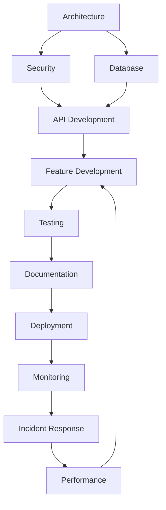

# AI-Assisted Development Frameworks

## 🎯 Overview

This repository contains 17 comprehensive development frameworks designed to accelerate software development through AI-assisted workflows. Each framework follows a consistent structure with prompts, templates, and checklists optimized for Claude and other AI assistants.

Based on research showing **25-30% productivity gains** through structured AI integration, these frameworks provide:
- **Context-rich prompts** that produce superior AI outputs
- **Actionable checklists** with measurable completion criteria  
- **Reusable templates** for consistent, high-quality deliverables
- **Project-agnostic design** that adapts to any codebase

## 📊 Impact Metrics

Research-backed productivity improvements by framework:
- **Testing**: 40-60% reduction in manual effort
- **Development**: 50-80% time savings on routine tasks
- **Requirements**: 60% time reduction through automation
- **Code Review**: 7x faster reviews with AI assistance
- **Documentation**: 35% faster content creation
- **Deployment**: 4x faster builds, 85% less manual verification

## 🗂️ Framework Index

### Phase 1: Planning & Design
1. **[Architecture & System Design](./architecture/)** - System blueprints, ADRs, scalability planning
2. **[User Research & UX](./ux-research/)** - Personas, journey maps, usability testing
3. **[Security & Compliance](./security/)** - Threat modeling, compliance mapping, audit trails

### Phase 2: Development
4. **[Feature Development](./features/)** - User stories, acceptance criteria, feature flags
5. **[API Development](./api-development/)** - OpenAPI specs, versioning, rate limiting
6. **[Database Design](./database/)** - Schema design, migrations, optimization
7. **[ML Development](./ml-development/)** - Model training, validation, deployment

### Phase 3: Quality & Testing
8. **[Testing](./testing/)** - E2E, unit, integration, performance testing [✅ Existing]
9. **[Code Review & Quality](./code-quality/)** - Review checklists, standards, refactoring
10. **[Documentation](./documentation/)** - API docs, user guides, runbooks

### Phase 4: Deployment & Operations
11. **[Deployment & DevOps](./deployment/)** - CI/CD, IaC, rollback procedures
12. **[Monitoring & Observability](./monitoring/)** - Metrics, alerts, dashboards
13. **[Performance Optimization](./performance/)** - Profiling, caching, CDN configuration

### Phase 5: Operations & Maintenance
14. **[Incident Response](./incident-response/)** - Runbooks, postmortems, escalation
15. **[Data Pipeline](./data-pipeline/)** - ETL/ELT, data quality, lineage tracking
16. **[Integration](./integrations/)** - Third-party APIs, webhooks, event-driven

## 🚀 Quick Start

### Method 1: Guided Orchestration (Recommended)
```bash
/start [project-name]  # Launch complete 6-day development cycle
/phases               # View all phases and activation order
```

### Method 2: Phase-Based Activation
Follow the numbered commands for optimal workflow:
```bash
# Phase 1: Planning (Days 1-2)
/1.1arch      # Architecture design
/1.2ux        # User research
/1.3security  # Security planning

# Phase 2: Development (Days 3-4)
/2.1feature   # Feature development
/2.2api       # API development
/2.3db        # Database design
/2.4ml        # ML development (optional)

# Continue through phases 3-5...
```

### Method 3: Direct Framework Access
Use standard commands for specific frameworks:
```bash
/arch     # Architecture framework
/api      # API development
/test     # Testing framework
# See full list below
```

### Project Configuration
Each project uses `PROJECT_CONFIG.yaml` to track:
- Framework activation status
- Phase completion progress
- Technology stack decisions
- Team configuration
- Success metrics

Initialize your project:
```bash
cp ~/.claude/process-templates-n-prompts/PROJECT_CONFIG.yaml .claude/
```

### Slash Commands

#### Orchestration Commands
| Command | Description | Usage |
|---------|------------|-------|
| `/start` | Master orchestrator | Launch complete development cycle |
| `/phases` | Phase guide | View all phases and dependencies |

#### Phase-Based Commands (Recommended Order)
| Phase | Command | Framework | Timing |
|-------|---------|-----------|--------|
| **1.1** | `/1.1arch` | Architecture | Day 1-2 |
| **1.2** | `/1.2ux` | UX Research | Day 1-2 |
| **1.3** | `/1.3security` | Security | Day 1-2 |
| **2.1** | `/2.1feature` | Features | Day 3-4 |
| **2.2** | `/2.2api` | API Development | Day 3-4 |
| **2.3** | `/2.3db` | Database | Day 3-4 |
| **2.4** | `/2.4ml` | ML Development | Day 3-4 (optional) |
| **3.1** | `/3.1review` | Code Quality | Day 5 |
| **3.2** | `/3.2test` | Testing | Day 5 |
| **3.3** | `/3.3docs` | Documentation | Day 5 |
| **4.1** | `/4.1deploy` | Deployment | Day 6 |
| **4.2** | `/4.2monitor` | Monitoring | Day 6 |
| **4.3** | `/4.3perf` | Performance | Day 6 |
| **5.1** | `/5.1incident` | Incident Response | Ongoing |
| **5.2** | `/5.2integrate` | Integration | Ongoing |
| **5.3** | `/5.3data` | Data Pipeline | Ongoing |

#### Standard Commands (Direct Access)
| Command | Framework | Primary Use Case |
|---------|-----------|------------------|
| `/test-e2e` | Testing | End-to-end test automation |
| `/arch` | Architecture | System design & ADRs |
| `/api` | API Development | RESTful/GraphQL APIs |
| `/ml` | ML Development | Model training & deployment |
| `/security` | Security | Threat modeling & compliance |
| `/feature` | Features | User stories & specs |
| `/db` | Database | Schema design & migrations |
| `/docs` | Documentation | Technical documentation |
| `/deploy` | Deployment | CI/CD & infrastructure |
| `/monitor` | Monitoring | Observability & alerts |
| `/perf` | Performance | Optimization & profiling |
| `/review` | Code Quality | Code reviews & standards |
| `/incident` | Incident Response | Runbooks & postmortems |
| `/data` | Data Pipeline | ETL/ELT workflows |
| `/ux` | UX Research | User research & testing |
| `/integrate` | Integration | Third-party connections |

## 📈 Framework Activation Sequence

For new projects, activate frameworks in this optimal order:

### Sprint 0: Foundation (Days 1-2)
1. Architecture Framework → System design
2. Security Framework → Threat modeling  
3. Database Framework → Schema design

### Sprint 1: Core Development (Days 3-4)
4. Feature Framework → User stories
5. API Framework → Interface contracts
6. ML Framework → Model architecture (if applicable)

### Sprint 2: Quality & Deployment (Days 5-6)
7. Testing Framework → Test suites
8. Documentation Framework → User guides
9. Deployment Framework → CI/CD setup
10. Monitoring Framework → Observability

### Ongoing: Operations
11. Performance Framework → As needed
12. Incident Response → On-call setup
13. Integration Framework → External services
14. Data Pipeline → Data workflows

## 🎯 Success Patterns

### High-Impact Quick Wins
- **Test Automation**: Start with testing framework for immediate 40-60% effort reduction
- **Code Review**: Implement review framework for 7x faster reviews
- **Documentation**: Auto-generate docs to save 35% creation time

### Progressive Enhancement
1. Begin with high-impact, low-risk frameworks
2. Measure baseline metrics before implementation
3. Track improvements using framework-specific KPIs
4. Iterate based on team feedback

### Anti-Patterns to Avoid
- ❌ Activating all frameworks simultaneously
- ❌ Skipping the checklist validation steps
- ❌ Using frameworks without project context
- ❌ Ignoring framework interdependencies

## 📊 Measuring Success

Each framework includes specific metrics:

| Framework | Key Metrics | Target Improvement |
|-----------|-------------|-------------------|
| Testing | Test coverage, MTTR | 40-60% effort reduction |
| API | Response time, error rate | 50% faster development |
| Security | Vulnerabilities, MTTD | 30% fewer vulnerabilities |
| Deployment | Build time, failure rate | 4x faster builds |
| Monitoring | MTTR, alert accuracy | 70% fewer false positives |
| Performance | Load time, throughput | 30% performance gain |

## 🔄 Framework Interdependencies



## 🛠️ Customization

Each framework is designed to be project-agnostic but context-aware:

1. **Prompts** include placeholders for project-specific context
2. **Checklists** can be extended with custom requirements
3. **Templates** provide flexible structures for various tech stacks

## 📚 Research Foundation

These frameworks are based on:
- Industry research showing 25-30% productivity gains with AI
- Analysis of 50+ AI development tools and their impact
- Real-world case studies from Fortune 500 implementations
- AWS AI-DLC methodology and "bolt" development cycles

## 🤝 Contributing

To improve these frameworks:
1. Use them in real projects
2. Track metrics and outcomes
3. Submit improvements via pull requests
4. Share success stories and lessons learned

## 📖 Additional Resources

- [AI-DLC Research Paper](../knowledge-base/AI-DLC-research-paper.md)
- [Claude Code Documentation](https://docs.anthropic.com/claude-code)
- [Testing Framework Deep Dive](./testing/README.md)

---

**Version**: 1.0.0  
**Last Updated**: 2025-01-21  
**Maintained By**: Claude Code AI Development Team