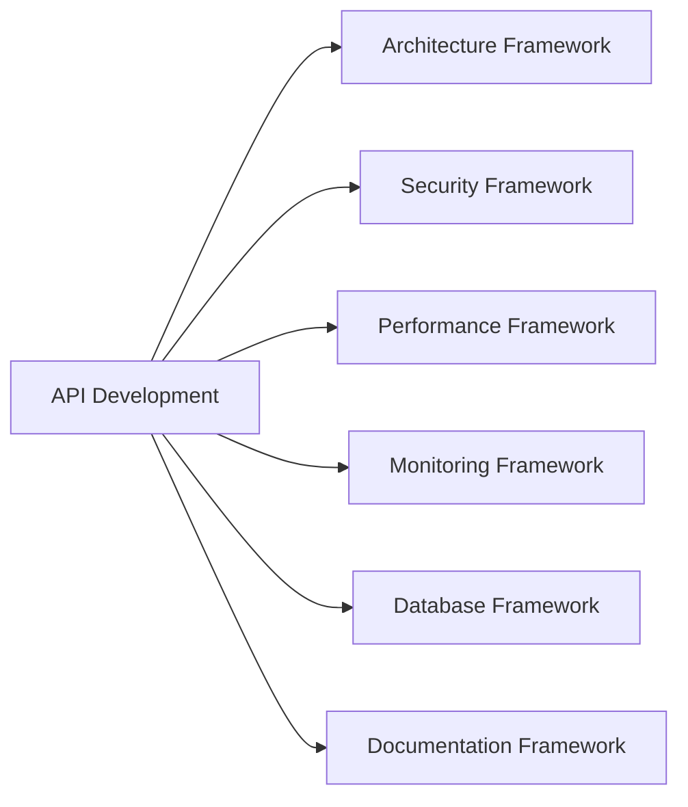

# API Development Framework

## Overview
The API Development Framework provides comprehensive guidance for building robust, scalable, and developer-friendly APIs. It covers REST, GraphQL, real-time APIs, and modern development practices aligned with AI-DLC principles for 50-80% productivity gains.

## Framework Components

### 1. AI Context (`api-development-prompt.md`)
- Specialized API development expertise context
- Integration points with other AI-DLC frameworks
- Context-aware guidance for different API types and scales
- 6-day development cycle approach

### 2. Development Checklist (`api-development-checklist.md`)
- **Phase 1**: API design and planning (Days 1-2)
- **Phase 2**: Core implementation with validation (Days 3-4)
- **Phase 3**: Security and performance optimization (Day 5)
- **Phase 4**: Documentation and deployment (Day 6)

### 3. Code Templates (`api-development-template.md`)
- Express.js REST API implementation
- FastAPI Python template
- OpenAPI 3.0 specifications
- GraphQL schema definitions
- Docker configuration

## Key Features

### Multi-Protocol Support
- **REST APIs**: Resource-oriented, HTTP-based APIs
- **GraphQL**: Flexible query language and runtime
- **Real-time**: WebSockets, Server-Sent Events
- **RPC**: Remote procedure calls for service communication

### Developer Experience Focus
- Interactive API documentation
- Code generation and SDKs
- Comprehensive error handling
- Intuitive authentication flows

### Production-Ready Features
- Authentication and authorization
- Rate limiting and throttling
- Caching and performance optimization
- Comprehensive monitoring and logging

## Integration Points



## Quick Start

### 1. API Planning
```bash
# Use the checklist for requirements analysis
# Design resource-oriented URLs and data models
# Create OpenAPI specification
```

### 2. Implementation
```javascript
// Use Express.js template for REST APIs
const app = require('./api-template');

// Add your specific business logic
app.post('/api/resources', async (req, res) => {
  // Implementation here
});
```

### 3. Documentation
```yaml
# Use OpenAPI template for API specification
openapi: 3.0.3
info:
  title: Your API
  version: 1.0.0
```

## Success Metrics

### Performance Targets
- **Response Time**: <200ms average for standard operations
- **Throughput**: Handle expected concurrent users
- **Availability**: >99.9% uptime for production APIs

### Developer Experience
- **Documentation Coverage**: 100% of public endpoints
- **API Adoption**: High usage rates, low abandonment
- **Developer Satisfaction**: Positive feedback scores

### Security & Compliance
- **Vulnerability Score**: Zero critical security issues
- **Authentication Success**: >99% valid token validation
- **Rate Limiting**: Effective protection against abuse

## Best Practices

### API Design Principles
1. **Consistency**: Follow established conventions
2. **Intuitiveness**: Self-explanatory resource naming
3. **Versioning**: Plan for backward compatibility
4. **Error Handling**: Meaningful error messages

### Security Best Practices
- Implement proper authentication and authorization
- Validate and sanitize all inputs
- Use HTTPS for all communications
- Apply rate limiting and request throttling

### Performance Optimization
- Implement caching strategies
- Use pagination for large datasets
- Optimize database queries
- Compress responses

## Common Patterns

### Resource-Based URLs
```
GET    /api/users           # List users
POST   /api/users           # Create user
GET    /api/users/123       # Get specific user
PUT    /api/users/123       # Update user
DELETE /api/users/123       # Delete user
```

### Pagination Pattern
```json
{
  "data": [...],
  "pagination": {
    "page": 1,
    "limit": 10,
    "total": 100,
    "pages": 10
  }
}
```

### Error Response Pattern
```json
{
  "error": "Validation failed",
  "code": "VALIDATION_ERROR",
  "details": [
    {
      "field": "email",
      "message": "Email is required"
    }
  ]
}
```

## Authentication Strategies

### JWT Token Authentication
```javascript
const jwt = require('jsonwebtoken');

const authenticateToken = (req, res, next) => {
  const token = req.headers.authorization?.split(' ')[1];
  
  if (!token) {
    return res.status(401).json({ error: 'Access token required' });
  }
  
  jwt.verify(token, process.env.JWT_SECRET, (err, user) => {
    if (err) return res.status(403).json({ error: 'Invalid token' });
    req.user = user;
    next();
  });
};
```

### OAuth 2.0 Integration
- Support for popular OAuth providers
- Secure token exchange flows
- Refresh token management
- Scope-based access control

## Testing Strategies

### Unit Testing
```javascript
describe('User API', () => {
  test('should create user with valid data', async () => {
    const response = await request(app)
      .post('/api/users')
      .send({
        email: 'test@example.com',
        password: 'password123',
        name: 'Test User'
      });
    
    expect(response.status).toBe(201);
    expect(response.body.user.email).toBe('test@example.com');
  });
});
```

### Integration Testing
- Test complete API workflows
- Validate database interactions
- Test authentication flows
- Performance and load testing

## Monitoring & Observability

### Key Metrics
- Request/response times
- Error rates and types
- API usage patterns
- Resource utilization

### Logging Best Practices
```javascript
const logger = require('winston');

app.use((req, res, next) => {
  logger.info({
    method: req.method,
    url: req.url,
    userAgent: req.get('User-Agent'),
    timestamp: new Date().toISOString()
  });
  next();
});
```

## Deployment Considerations

### Environment Configuration
- Separate configs for dev/staging/prod
- Secure secret management
- Environment-specific features

### Scalability Planning
- Horizontal scaling with load balancers
- Database connection pooling
- Caching layer implementation
- CDN integration for static content

## Framework Evolution

### Version History
- **v1.0**: Initial REST API patterns
- **v1.1**: GraphQL support added
- **v1.2**: Real-time capabilities
- **v2.0**: Microservices patterns

### Roadmap
- [ ] gRPC service templates
- [ ] API gateway integration
- [ ] Advanced security patterns
- [ ] Serverless deployment options

This framework enables teams to build production-ready APIs efficiently while maintaining high standards for security, performance, and developer experience.