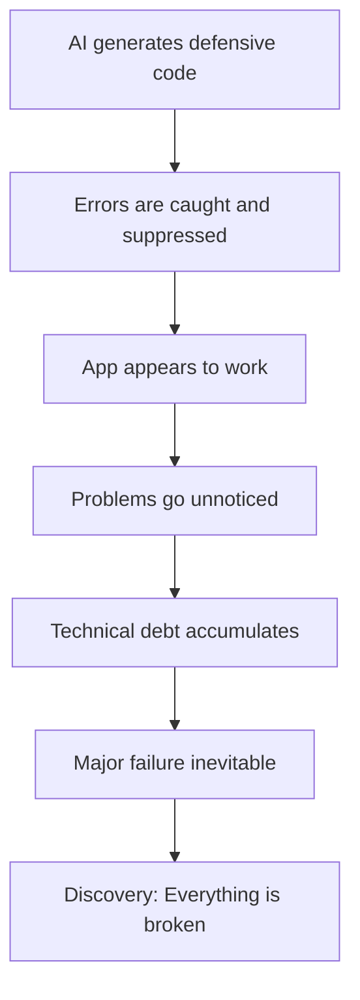

# Why AI Development Creates Silent Failures: Root Cause Analysis & Prevention Guide

## 🧠 The Root Problem

AI models (ChatGPT, Claude, Copilot) are trained to be **helpful above all else**. This creates code that:
- **Always tries to work** even when it shouldn't
- **Provides something** rather than failing appropriately
- **Handles every edge case** with fallbacks instead of errors
- **Mimics patterns** from training data that include development conveniences

## 🔍 Why This Happens: The AI Training Paradox

### 1. **The Helpfulness Bias**
AI models are rewarded during training for providing working solutions. This creates a strong bias toward:
```javascript
// AI naturally generates this:
try {
  return await fetchData();
} catch (error) {
  console.warn('Failed to fetch, using default');
  return { data: [] }; // "Helpful" but wrong
}

// Instead of this:
const data = await fetchData(); // Let it fail if it fails
```

### 2. **The Completion Compulsion**
AI wants to complete every code path, leading to:
```javascript
// AI generates complete handling:
if (database.isConnected()) {
  return database.query(sql);
} else {
  // AI adds this "helpful" branch
  return mockData; // DISASTER in production
}
```

### 3. **The Pattern Matching Problem**
AI has seen millions of examples with development conveniences:
```javascript
// Common in tutorials and examples:
const API_KEY = process.env.API_KEY || 'test-key-for-development';
// AI learns this is "normal" and replicates it
```

### 4. **The Defensive Programming Overflow**
AI takes defensive programming to an extreme:
```javascript
// Overly defensive, hides real issues:
function getUser(id) {
  try {
    if (!id) return null;
    if (!database) return null;
    if (!database.connected) return null;
    const user = database.getUser(id);
    if (!user) return null;
    return user;
  } catch (e) {
    return null; // Everything returns null!
  }
}
```

## 📊 The Silent Failure Cascade



## 🎯 Core Anti-Patterns from AI

### 1. **The Mock Data Trap**
```javascript
// AI often generates:
class UserService {
  async getUser(id) {
    try {
      return await db.query(`SELECT * FROM users WHERE id = ${id}`);
    } catch (error) {
      // "Helpful" fallback
      return {
        id: id,
        name: 'Default User',
        email: 'user@example.com'
      };
    }
  }
}
```
**Problem**: App works in dev, fails silently in production

### 2. **The Optional Everything Pattern**
```javascript
// AI makes everything optional:
const result = await service?.call?.() || defaultValue;
```
**Problem**: Can't distinguish between "service is down" and "service returned falsy value"

### 3. **The Infinite Fallback Chain**
```javascript
// AI creates layers of fallbacks:
const config = 
  process.env.CONFIG ||
  await fetchConfig() ||
  readLocalConfig() ||
  DEFAULT_CONFIG;
```
**Problem**: Never know which config you're actually using

### 4. **The Catch-and-Continue Disease**
```javascript
// AI handles errors by ignoring them:
async function processOrders() {
  for (const order of orders) {
    try {
      await processOrder(order);
    } catch (error) {
      console.error(`Failed to process order ${order.id}`);
      continue; // Just skip it!
    }
  }
}
```
**Problem**: Critical failures treated as minor inconveniences

## 🛡️ Prevention Strategies

### Strategy 1: Explicit Prompt Engineering
Always include these in your prompts:
```markdown
CRITICAL REQUIREMENTS:
1. NO mock data in production code paths
2. NO empty catch blocks
3. NO silent fallbacks for failures
4. FAIL FAST when dependencies are missing
5. Errors must be propagated, not swallowed
6. Required services must be validated at startup
```

### Strategy 2: The Three-Environment Mindset
```javascript
// Teach AI to distinguish environments:
class Service {
  constructor() {
    if (process.env.NODE_ENV === 'production') {
      // PRODUCTION: Fail fast, no mocks
      if (!process.env.API_KEY) {
        throw new Error('API_KEY required in production');
      }
    } else if (process.env.NODE_ENV === 'development') {
      // DEVELOPMENT: Helpful conveniences OK
      this.apiKey = process.env.API_KEY || 'dev-key';
    } else {
      // TEST: Explicit mocks OK
      this.apiKey = 'test-key';
    }
  }
}
```

### Strategy 3: The Startup Validation Pattern
```javascript
// Force AI to generate startup checks:
class Application {
  static async start() {
    // FIRST: Validate everything
    await this.validateRequirements();
    
    // ONLY THEN: Start the app
    await this.initializeServices();
    await this.startServer();
  }
  
  static async validateRequirements() {
    const required = [
      { name: 'Database', check: () => db.ping() },
      { name: 'Redis', check: () => redis.ping() },
      { name: 'API Key', check: () => !!process.env.API_KEY }
    ];
    
    for (const { name, check } of required) {
      if (!await check()) {
        console.error(`FATAL: ${name} is required`);
        process.exit(1); // FAIL FAST
      }
    }
  }
}
```

### Strategy 4: The Observability-First Approach
```javascript
// Make AI include observability from the start:
class ServiceWithObservability {
  private metrics = new Metrics();
  private logger = new Logger();
  
  async operation() {
    const start = Date.now();
    try {
      const result = await this.doOperation();
      this.metrics.recordSuccess('operation', Date.now() - start);
      return result;
    } catch (error) {
      this.metrics.recordFailure('operation', Date.now() - start);
      this.logger.error('Operation failed', { error, context: this.context });
      throw error; // ALWAYS RE-THROW
    }
  }
}
```

## 🔧 Fixing AI-Generated Code

### The Review Checklist
When reviewing AI-generated code, look for:

1. **🔴 Red Flags**
   - `catch` blocks that don't re-throw
   - Functions that can't fail (always return something)
   - Hardcoded fallback values
   - Mock/fake/dummy/test data in non-test files

2. **🟡 Warning Signs**
   - Excessive use of optional chaining `?.`
   - Multiple fallback values with `||`
   - Console.warn without other action
   - Try-catch around every operation

3. **🟢 Good Signs**
   - Errors bubble up to error handlers
   - Clear distinction between required/optional
   - Health checks for external services
   - Startup validation

### The Refactoring Process

```javascript
// Step 1: Identify silent failures
function findSilentFailures(code) {
  const patterns = [
    /catch.*{[\s]*}/,           // Empty catch
    /catch.*console\./,         // Log-only catch
    /return.*mock/i,            // Mock returns
    /\|\|.*default/i,           // Default fallbacks
  ];
  return patterns.some(p => p.test(code));
}

// Step 2: Replace with proper error handling
function refactorSilentFailure(code) {
  // Remove mock returns
  code = code.replace(/return mockData;/, 'throw new Error("Service unavailable");');
  
  // Fix empty catches
  code = code.replace(/catch \(e\) {}/, 'catch (e) { throw e; }');
  
  // Remove fallbacks
  code = code.replace(/\|\| defaultValue/, '');
  
  return code;
}
```

## 📈 Measuring Success

### Metrics to Track
After fixing silent failures, you should see:

1. **Increased Error Rates (Initially)**
   - This is GOOD - you're seeing real failures now
   - Error rate should stabilize as you fix root causes

2. **Faster Time to Detection**
   - Before: Hours/days to notice issues
   - After: Immediate alerts when things break

3. **Reduced Incident Resolution Time**
   - Before: "Works on my machine" debugging
   - After: Clear error messages and stack traces

4. **Improved User Trust**
   - Before: "The app seems broken but says it's working"
   - After: "I know when something's wrong and it gets fixed"

## 🎓 Training Your Team

### For Developers
1. **Understand the AI bias** - AI wants to help, not fail appropriately
2. **Review generated code critically** - Don't trust, verify
3. **Test failure scenarios** - What happens when services are down?
4. **Embrace failing fast** - Better to crash than corrupt

### For Architects
1. **Design for observability** - Make failures visible
2. **Separate environments clearly** - Dev conveniences ≠ production code
3. **Require startup validation** - Don't let broken apps start
4. **Monitor everything** - You can't fix what you can't see

### For Product Managers
1. **Expect initial instability** - Removing silent failures reveals real issues
2. **Prioritize monitoring** - Invest in observability tools
3. **Communicate degraded modes** - Users deserve transparency
4. **Plan for failure** - Every external dependency will fail

## 🚀 The Path Forward

### Phase 1: Discovery (Week 1)
- Run silent failure detection
- Identify all mock/fallback code
- Map external dependencies
- Document current failure modes

### Phase 2: Remediation (Week 2-3)
- Remove all silent failures
- Add startup validation
- Implement health checks
- Configure monitoring

### Phase 3: Hardening (Week 4+)
- Add circuit breakers
- Implement proper retries
- Create runbooks
- Train team

### Phase 4: Prevention (Ongoing)
- Update AI prompts
- Code review checklists
- Automated detection in CI/CD
- Regular audits

## 💡 Key Takeaways

1. **AI-generated code optimizes for "working" over "correct"**
2. **Silent failures are worse than loud failures**
3. **Production is not the place for conveniences**
4. **Observability must be built-in, not bolted-on**
5. **Fail fast, fail loud, fail informatively**

## 📚 Remember

> "The road to production hell is paved with good exceptions"

Every `try-catch`, every fallback, every mock response is a potential silent failure waiting to happen. Be ruthless in removing them from production code paths.

**Your users would rather see an error message than use a broken app that pretends to work.**