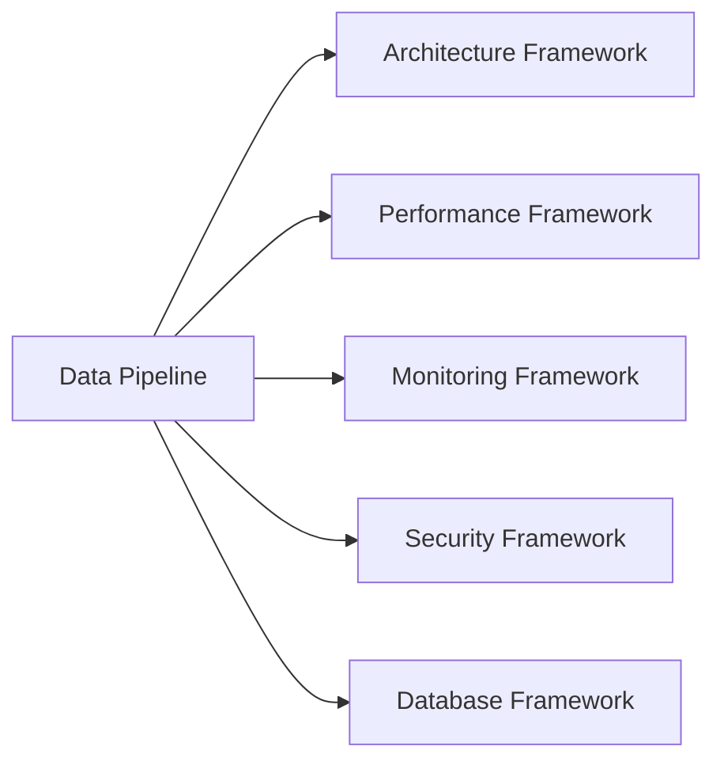

# Data Pipeline Framework

## Overview
The Data Pipeline Framework provides comprehensive guidance for building robust, scalable data processing systems. It covers batch and streaming pipelines, data quality assurance, and operational best practices aligned with AI-DLC principles for 50-80% productivity gains.

## Framework Components

### 1. AI Context (`data-pipeline-prompt.md`)
- Specialized data engineering expertise context
- Integration points with other AI-DLC frameworks
- Context-aware guidance for different data volumes and technologies
- 6-day development cycle approach

### 2. Development Checklist (`data-pipeline-checklist.md`)
- **Phase 1**: Pipeline design and planning (Days 1-2)
- **Phase 2**: Core implementation with validation (Days 3-4)  
- **Phase 3**: Optimization and reliability (Day 5)
- **Phase 4**: Monitoring and deployment (Day 6)

### 3. Code Templates (`data-pipeline-template.md`)
- Apache Airflow DAG templates
- Data validation frameworks
- Spark processing templates
- Configuration management
- Docker infrastructure setup

## Key Features

### Multi-Technology Support
- **Orchestration**: Airflow, Prefect, Luigi
- **Processing**: Spark, Kafka, Flink
- **Storage**: Data lakes, warehouses, time-series DBs
- **Cloud**: AWS Glue/Kinesis, GCP Dataflow, Azure Data Factory

### Data Quality First
- Schema validation and data profiling
- Real-time quality monitoring
- Automated anomaly detection
- Comprehensive error handling

### Operational Excellence
- Built-in monitoring and alerting
- Performance optimization guides
- Disaster recovery procedures
- Cost optimization strategies

## Integration Points



## Quick Start

### 1. Pipeline Planning
```bash
# Use the checklist for requirements analysis
# Define data sources, transformations, and targets
# Select appropriate technology stack
```

### 2. Implementation
```python
# Use Airflow DAG template for orchestration
# Implement data validation with provided classes
# Add Spark processing for large datasets
```

### 3. Deployment
```yaml
# Use Docker Compose for local development
# Configure monitoring and alerting
# Set up CI/CD with quality gates
```

## Success Metrics

### Reliability Targets
- **Uptime**: >99.5% for critical pipelines
- **Error Rate**: <0.1% in processed data
- **Recovery Time**: <1 hour for pipeline failures

### Performance Benchmarks
- **Batch Processing**: Complete within scheduled windows
- **Streaming**: Sub-second latency for real-time requirements
- **Resource Efficiency**: Optimal cost per processed record

### Quality Assurance
- **Data Validation**: 100% coverage for critical business rules
- **Monitoring**: Real-time visibility into pipeline health
- **Documentation**: Complete operational runbooks

## Best Practices

### Design Principles
1. **Idempotency**: Pipelines should be safe to re-run
2. **Observability**: Comprehensive logging and monitoring
3. **Scalability**: Handle growing data volumes efficiently
4. **Maintainability**: Clear, documented, testable code

### Common Patterns
- **Lambda Architecture**: Batch + streaming for comprehensive analytics
- **Kappa Architecture**: Streaming-first with batch reprocessing
- **Medallion Architecture**: Bronze/Silver/Gold data layers
- **Event-Driven**: React to data changes in real-time

## Troubleshooting Guide

### Common Issues
| Issue | Symptoms | Solution |
|-------|----------|----------|
| Pipeline Failures | Tasks failing consistently | Check error logs, validate data sources |
| Performance Issues | Slow processing times | Profile bottlenecks, optimize queries |
| Data Quality Problems | Validation errors increasing | Review business rules, update validations |
| Resource Constraints | Out of memory errors | Scale resources, optimize algorithms |

### Debugging Checklist
- [ ] Check pipeline logs for error details
- [ ] Validate input data quality and schema
- [ ] Monitor resource utilization metrics
- [ ] Test with smaller data samples
- [ ] Verify configuration parameters

## Cost Optimization

### Strategies
1. **Right-sizing**: Match resources to workload requirements
2. **Scheduling**: Run non-critical jobs during off-peak hours
3. **Compression**: Use appropriate data formats (Parquet, ORC)
4. **Partitioning**: Optimize data layout for query patterns
5. **Caching**: Store frequently accessed intermediate results

### Monitoring
- Track cost per pipeline execution
- Monitor resource utilization trends
- Set up cost alerts for budget overruns
- Regular cost optimization reviews

## Security & Compliance

### Data Protection
- Encrypt data in transit and at rest
- Implement proper access controls
- Audit data access and modifications
- Handle PII according to regulations

### Compliance Features
- Data lineage tracking
- Audit trail maintenance
- Data retention policy enforcement
- Privacy regulation compliance (GDPR, CCPA)

## Framework Evolution

### Version History
- **v1.0**: Initial release with core pipeline patterns
- **v1.1**: Added streaming processing templates
- **v1.2**: Enhanced monitoring and alerting
- **v2.0**: Cloud-native deployment options

### Roadmap
- [ ] MLOps pipeline integration
- [ ] Real-time feature store patterns
- [ ] Advanced data governance tools
- [ ] Multi-cloud deployment templates

This framework enables teams to build production-ready data pipelines efficiently while maintaining high quality and operational standards.