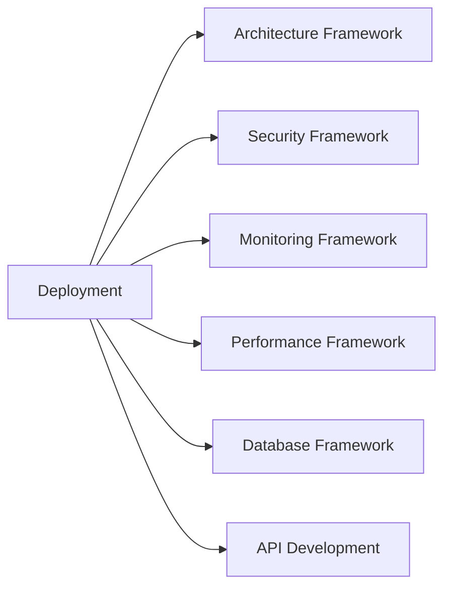

# Deployment & DevOps Framework

## Overview
The Deployment & DevOps Framework provides comprehensive guidance for building reliable, scalable deployment pipelines and infrastructure management systems. It covers CI/CD, containerization, cloud platforms, infrastructure as code, and operational excellence aligned with AI-DLC principles for 50-80% productivity gains.

## Framework Components

### 1. AI Context (`deployment-prompt.md`)
- Specialized DevOps engineering expertise context
- Integration points with other AI-DLC frameworks
- Context-aware guidance for different infrastructure scales and complexities
- 6-day development cycle approach

### 2. Development Checklist (`deployment-checklist.md`)
- **Phase 1**: Infrastructure design and CI/CD setup (Days 1-2)
- **Phase 2**: Deployment automation and testing (Days 3-4)
- **Phase 3**: Monitoring and security implementation (Day 5)
- **Phase 4**: Production readiness and operations (Day 6)

### 3. Deployment Templates (`deployment-template.md`)
- GitHub Actions CI/CD pipelines
- Terraform infrastructure as code
- Kubernetes deployment manifests
- Docker containerization
- Monitoring and observability setup

## Key Features

### CI/CD Excellence
- **Automated Testing**: Unit, integration, security, and performance tests
- **Deployment Strategies**: Blue-green, rolling, canary deployments
- **Pipeline Security**: Vulnerability scanning, secrets management
- **Artifact Management**: Container registry, version control

### Infrastructure as Code
- **Cloud-Agnostic**: AWS, GCP, Azure, DigitalOcean support
- **Modular Design**: Reusable infrastructure components
- **Environment Management**: Dev, staging, production consistency
- **Cost Optimization**: Resource scaling and optimization

### Container Orchestration
- **Kubernetes Native**: Production-ready K8s manifests
- **Security Hardening**: Pod security standards, network policies
- **Auto-scaling**: HPA, VPA, cluster autoscaling
- **Service Mesh**: Istio, Linkerd integration patterns

## Integration Points



## Quick Start

### 1. Infrastructure Setup
```bash
# Initialize Terraform
terraform init
terraform plan
terraform apply

# Configure kubectl
aws eks update-kubeconfig --name your-cluster
```

### 2. CI/CD Pipeline
```yaml
# Use GitHub Actions template
name: Deploy
on:
  push:
    branches: [main]
jobs:
  deploy:
    runs-on: ubuntu-latest
    steps:
      - uses: actions/checkout@v4
      - name: Deploy
        run: ./deploy.sh
```

### 3. Container Deployment
```bash
# Build and deploy
docker build -t your-app .
kubectl apply -f k8s/
kubectl rollout status deployment/your-app
```

## Success Metrics

### Deployment Performance
- **Deployment Frequency**: Daily deployments with zero downtime
- **Lead Time**: <4 hours from commit to production
- **Mean Time to Recovery**: <30 minutes for incidents
- **Change Failure Rate**: <5% of deployments cause issues

### Infrastructure Reliability
- **Availability**: >99.9% uptime for production services
- **Scalability**: Auto-scaling based on demand
- **Security**: Zero critical vulnerabilities in production
- **Cost Efficiency**: Optimized resource utilization

### Operational Excellence
- **Monitoring Coverage**: 100% infrastructure and application monitoring
- **Alert Response**: <15 minutes mean time to acknowledge
- **Documentation**: Complete runbooks and procedures
- **Team Productivity**: Reduced manual intervention

## Best Practices

### CI/CD Pipeline Design
1. **Fast Feedback**: Quick build and test cycles
2. **Security First**: Security scanning at every stage
3. **Automated Testing**: Comprehensive test coverage
4. **Deployment Strategies**: Safe, rollback-capable deployments

### Infrastructure Management
```hcl
# Terraform best practices
resource "aws_instance" "app" {
  instance_type = var.instance_type
  
  tags = {
    Name        = "${var.app_name}-${var.environment}"
    Environment = var.environment
    ManagedBy   = "terraform"
  }
  
  lifecycle {
    create_before_destroy = true
  }
}
```

### Container Security
```yaml
# Kubernetes security best practices
securityContext:
  runAsNonRoot: true
  runAsUser: 1000
  readOnlyRootFilesystem: true
  allowPrivilegeEscalation: false
  capabilities:
    drop:
      - ALL
```

## Deployment Strategies

### Blue-Green Deployment
```bash
# Deploy to green environment
kubectl set image deployment/app-green app=newversion
kubectl rollout status deployment/app-green

# Switch traffic
kubectl patch service app -p '{"spec":{"selector":{"version":"green"}}}'

# Verify and cleanup
curl -f https://yourapp.com/health
kubectl scale deployment app-blue --replicas=0
```

### Canary Deployment
```yaml
# Canary deployment with Istio
apiVersion: networking.istio.io/v1alpha3
kind: VirtualService
metadata:
  name: app-canary
spec:
  http:
  - match:
    - headers:
        canary:
          exact: "true"
    route:
    - destination:
        host: app-service
        subset: canary
  - route:
    - destination:
        host: app-service
        subset: stable
      weight: 90
    - destination:
        host: app-service
        subset: canary
      weight: 10
```

### Rolling Deployment
```yaml
# Rolling update strategy
strategy:
  type: RollingUpdate
  rollingUpdate:
    maxUnavailable: 25%
    maxSurge: 25%
```

## Monitoring Integration

### Prometheus Metrics
```javascript
// Application metrics
const promClient = require('prom-client');

const httpRequestDuration = new promClient.Histogram({
  name: 'http_request_duration_seconds',
  help: 'Duration of HTTP requests in seconds',
  labelNames: ['method', 'route', 'status_code']
});

// Middleware
app.use((req, res, next) => {
  const start = Date.now();
  res.on('finish', () => {
    const duration = (Date.now() - start) / 1000;
    httpRequestDuration
      .labels(req.method, req.route?.path || req.url, res.statusCode)
      .observe(duration);
  });
  next();
});
```

### Alerting Rules
```yaml
# Critical alerts
- alert: HighErrorRate
  expr: rate(http_requests_total{status=~"5.."}[5m]) > 0.1
  for: 5m
  labels:
    severity: critical
  annotations:
    summary: "Application error rate is high"

- alert: PodCrashLooping
  expr: rate(kube_pod_container_status_restarts_total[15m]) > 0
  for: 5m
  labels:
    severity: critical
  annotations:
    summary: "Pod is crash looping"
```

## Cloud Platform Patterns

### AWS Deployment
```yaml
# ECS Fargate deployment
apiVersion: v1
kind: ConfigMap
metadata:
  name: aws-load-balancer-controller
data:
  cluster-name: your-cluster
  aws-region: us-east-1
```

### GCP Deployment
```yaml
# GKE autopilot configuration
apiVersion: v1
kind: Service
metadata:
  annotations:
    cloud.google.com/neg: '{"ingress": true}'
spec:
  type: NodePort
  ports:
  - port: 80
    targetPort: 8080
```

### Azure Deployment
```yaml
# AKS deployment
apiVersion: apps/v1
kind: Deployment
metadata:
  annotations:
    azure.workload.identity/use: "true"
spec:
  template:
    metadata:
      labels:
        azure.workload.identity/use: "true"
```

## Security Integration

### Secret Management
```yaml
# External Secrets Operator
apiVersion: external-secrets.io/v1beta1
kind: SecretStore
metadata:
  name: vault-backend
spec:
  provider:
    vault:
      server: "https://vault.example.com"
      path: "secret"
      version: "v2"
```

### Network Security
```yaml
# Network policies
apiVersion: networking.k8s.io/v1
kind: NetworkPolicy
metadata:
  name: deny-all
spec:
  podSelector: {}
  policyTypes:
  - Ingress
  - Egress
  egress:
  - to:
    - namespaceSelector:
        matchLabels:
          name: kube-system
    ports:
    - protocol: TCP
      port: 53
    - protocol: UDP
      port: 53
```

## Disaster Recovery

### Backup Strategy
```bash
# Automated backups
kubectl create cronjob db-backup \
  --image=postgres:15 \
  --schedule="0 2 * * *" \
  -- pg_dump -h db-host -U admin database > /backup/db-$(date +%Y%m%d).sql
```

### Multi-Region Setup
```hcl
# Terraform multi-region
provider "aws" {
  alias  = "primary"
  region = "us-east-1"
}

provider "aws" {
  alias  = "dr"
  region = "us-west-2"
}

module "primary_infrastructure" {
  source = "./modules/infrastructure"
  providers = {
    aws = aws.primary
  }
}

module "dr_infrastructure" {
  source = "./modules/infrastructure"
  providers = {
    aws = aws.dr
  }
}
```

## Cost Optimization

### Resource Management
```yaml
# Vertical Pod Autoscaler
apiVersion: autoscaling.k8s.io/v1
kind: VerticalPodAutoscaler
metadata:
  name: app-vpa
spec:
  targetRef:
    apiVersion: apps/v1
    kind: Deployment
    name: app
  updatePolicy:
    updateMode: "Auto"
```

### Spot Instances
```hcl
# Mixed instance types
resource "aws_autoscaling_group" "app" {
  mixed_instances_policy {
    instances_distribution {
      on_demand_base_capacity = 1
      on_demand_percentage_above_base_capacity = 20
      spot_allocation_strategy = "diversified"
    }
    
    launch_template {
      launch_template_specification {
        launch_template_id = aws_launch_template.app.id
        version = "$Latest"
      }
      
      override {
        instance_type = "t3.medium"
      }
      
      override {
        instance_type = "t3.large"
      }
    }
  }
}
```

## Framework Evolution

### Version History
- **v1.0**: Basic CI/CD and container deployment
- **v1.1**: Kubernetes integration and monitoring
- **v1.2**: Multi-cloud and security hardening
- **v2.0**: GitOps and advanced automation

### Roadmap
- [ ] GitOps with ArgoCD/Flux integration
- [ ] Advanced observability with OpenTelemetry
- [ ] Multi-cluster management
- [ ] Edge computing deployment patterns

This framework enables teams to build and maintain production-ready infrastructure and deployment pipelines efficiently while ensuring reliability, security, and operational excellence.