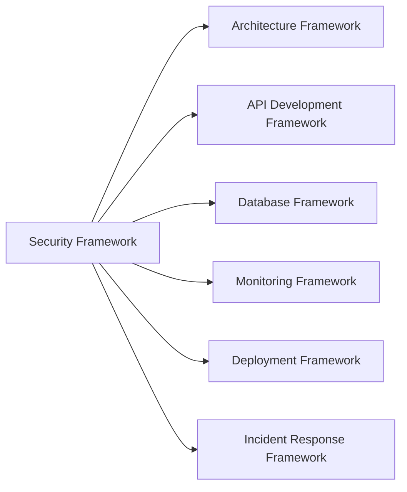
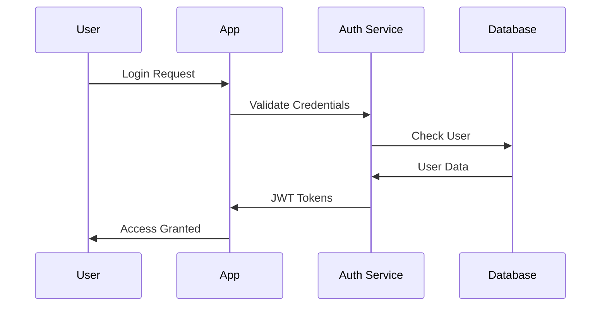

# Security & Compliance Framework

## Overview
The Security & Compliance Framework provides comprehensive guidance for building secure, compliant software systems with defense-in-depth strategies. It covers application security, infrastructure security, compliance frameworks, and threat modeling aligned with AI-DLC principles for 50-80% productivity gains.

## Framework Components

### 1. AI Context (`security-prompt.md`)
- Specialized security engineering expertise context
- Integration points with other AI-DLC frameworks
- Context-aware guidance for different security maturity levels
- 6-day development cycle approach

### 2. Development Checklist (`security-checklist.md`)
- **Phase 1**: Security requirements and threat modeling (Days 1-2)
- **Phase 2**: Security controls implementation (Days 3-4)
- **Phase 3**: Security testing and assessment (Day 5)
- **Phase 4**: Monitoring and response (Day 6)

### 3. Security Templates (`security-template.md`)
- Authentication and authorization implementations
- Input validation and sanitization
- Encryption and data protection
- Security headers and CORS
- Security monitoring and logging
- GDPR and SOC 2 compliance templates

## Key Features

### Multi-Layer Security
- **Application Security**: Input validation, authentication, authorization
- **Infrastructure Security**: Network security, server hardening, container security
- **Data Security**: Encryption at rest and in transit, key management
- **Operational Security**: Monitoring, logging, incident response

### Compliance Support
- **GDPR**: Data privacy and protection controls
- **SOC 2**: Security controls for service organizations
- **HIPAA**: Healthcare data protection
- **PCI DSS**: Payment card industry standards
- **ISO 27001**: Information security management

### Threat Protection
- **OWASP Top 10**: Protection against common vulnerabilities
- **Zero Trust**: Never trust, always verify approach
- **Defense in Depth**: Multiple layers of security controls
- **Continuous Monitoring**: Real-time threat detection and response

## Integration Points



## Quick Start

### 1. Security Assessment
```bash
# Use the checklist for security requirements analysis
# Conduct threat modeling for your application
# Identify compliance requirements
```

### 2. Implementation
```javascript
// Use authentication templates
const { AuthenticationService } = require('./security-templates');

// Implement input validation
app.use(SecurityValidator.preventSQLInjection);
app.use(SecurityValidator.preventXSS);
```

### 3. Monitoring
```javascript
// Set up security logging
const securityLogger = new SecurityLogger();
securityLogger.logSecurityEvent('AUTHENTICATION_ATTEMPT', details, req);
```

## Success Metrics

### Security Targets
- **Vulnerability Score**: Zero critical vulnerabilities in production
- **Authentication**: 100% authenticated access for protected resources
- **Data Protection**: 100% encryption coverage for sensitive data
- **Incident Response**: <30 minutes mean time to detection

### Compliance Scores
- **GDPR Compliance**: 100% for data privacy requirements
- **SOC 2**: All control objectives met
- **Industry Standards**: Full compliance with applicable regulations

### Security Testing
- **Code Coverage**: 100% security test coverage for critical paths
- **Penetration Testing**: Regular assessments with no critical findings
- **Vulnerability Scanning**: Continuous monitoring with automated remediation

## Security Patterns

### Authentication Flow


### Authorization Pattern
```javascript
// Role-based access control
const authorizeRoles = (...roles) => {
  return (req, res, next) => {
    if (!req.user || !roles.includes(req.user.role)) {
      return res.status(403).json({ error: 'Insufficient permissions' });
    }
    next();
  };
};

app.get('/admin/*', authenticateToken, authorizeRoles('admin'), handler);
```

### Data Encryption Pattern
```javascript
// Encrypt sensitive data before storage
const encryptionService = new EncryptionService();

// Before saving to database
user.socialSecurityNumber = encryptionService.encrypt(ssn);
user.creditCardNumber = encryptionService.encrypt(ccn);

// When retrieving for authorized use
const decryptedData = encryptionService.decrypt(user.socialSecurityNumber);
```

## Common Vulnerabilities & Prevention

### OWASP Top 10 Protection

| Vulnerability | Prevention | Implementation |
|---------------|------------|----------------|
| Injection | Input validation, parameterized queries | `SecurityValidator.preventSQLInjection` |
| Broken Authentication | Strong auth, MFA, session management | `AuthenticationService` |
| Sensitive Data Exposure | Encryption, secure storage | `EncryptionService` |
| XXE | Disable external entities, input validation | XML parser configuration |
| Broken Access Control | RBAC, authorization checks | `authorizeRoles` middleware |
| Security Misconfiguration | Secure defaults, hardening | Security headers, CORS |
| XSS | Input sanitization, CSP | `SecurityValidator.preventXSS` |
| Insecure Deserialization | Avoid untrusted data, validation | JSON schema validation |
| Known Vulnerabilities | Dependency scanning, updates | Automated vulnerability scanning |
| Insufficient Logging | Comprehensive logging, monitoring | `SecurityLogger` |

### Security Headers Implementation
```javascript
// Essential security headers
app.use(helmet({
  contentSecurityPolicy: {
    directives: {
      defaultSrc: ["'self'"],
      scriptSrc: ["'self'", "https://trusted-cdn.com"],
      styleSrc: ["'self'", "'unsafe-inline'"],
      imgSrc: ["'self'", "data:", "https:"]
    }
  },
  hsts: {
    maxAge: 31536000,
    includeSubDomains: true,
    preload: true
  }
}));
```

## Compliance Implementation

### GDPR Compliance Checklist
- [ ] Data processing lawful basis identified
- [ ] Privacy policy and consent management
- [ ] Data subject rights implementation
- [ ] Data breach notification procedures
- [ ] Data protection impact assessments
- [ ] Data retention and deletion policies

### SOC 2 Control Implementation
```yaml
# Example control implementation
access_control:
  - Multi-factor authentication required
  - Role-based permissions enforced
  - Regular access reviews conducted
  - Privileged access monitored

system_operations:
  - Automated monitoring and alerting
  - Capacity planning procedures
  - Change management process
  - Incident response procedures
```

## Security Testing Strategy

### Static Analysis (SAST)
```javascript
// Example: SonarQube configuration
{
  "sonar.sources": "src",
  "sonar.tests": "tests",
  "sonar.javascript.lcov.reportPaths": "coverage/lcov.info",
  "sonar.security.hotspots.disabled": false
}
```

### Dynamic Analysis (DAST)
```bash
# OWASP ZAP automated security testing
zap-baseline.py -t https://your-app.com -g gen.conf -r zap-report.html
```

### Dependency Scanning
```bash
# NPM audit for vulnerabilities
npm audit --audit-level moderate

# Snyk security scanning
snyk test --severity-threshold=high
```

## Incident Response

### Security Incident Classification
- **P1 Critical**: Active data breach, system compromise
- **P2 High**: Potential security vulnerability, suspicious activity
- **P3 Medium**: Policy violation, failed security control
- **P4 Low**: Security awareness, minor configuration issue

### Response Procedures
1. **Detection**: Automated monitoring and manual reporting
2. **Analysis**: Threat assessment and impact evaluation
3. **Containment**: Isolate affected systems, prevent spread
4. **Eradication**: Remove threat, patch vulnerabilities
5. **Recovery**: Restore services, monitor for recurrence
6. **Lessons Learned**: Post-incident review and improvements

## Framework Evolution

### Version History
- **v1.0**: Basic security controls and authentication
- **v1.1**: Compliance framework integration
- **v1.2**: Advanced threat protection
- **v2.0**: Zero-trust architecture patterns

### Roadmap
- [ ] AI-driven threat detection
- [ ] Advanced compliance automation
- [ ] Cloud-native security patterns
- [ ] DevSecOps integration templates

This framework enables teams to build secure, compliant applications efficiently while maintaining the highest security standards and regulatory compliance.