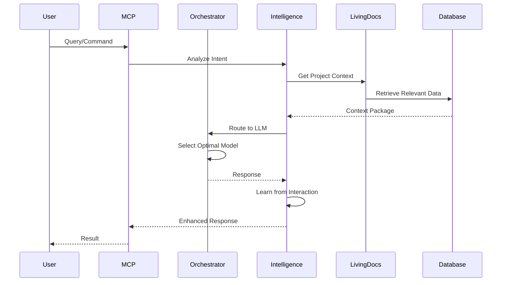

# Product Requirements Document: IronClaude
## Intelligent Real-time Orchestration & Navigation for Claude

**Document Version**: 1.0  
**Date**: August 26, 2025  
**Author**: John (Product Manager)  
**Status**: DRAFT  
**Review Cycle**: Initial  

---

## 1. Executive Summary

### 1.1 Product Vision
IronClaude is a unified intelligence system that fundamentally transforms how developers interact with AI coding assistants by creating a persistent, learning, context-aware platform that understands and evolves with each project's unique codebase, patterns, and team conventions.

### 1.2 Problem Statement
Current AI coding assistants suffer from critical limitations:
- **Context Amnesia**: Each query starts from zero with no memory of previous interactions
- **Outdated Knowledge**: LLMs trained on old data suggest deprecated patterns (e.g., React 16 when teams use React 19)
- **Generic Solutions**: Identical boilerplate code for everyone, ignoring project-specific patterns
- **Wasted Context**: Loading 200KB+ of manifests when only 10KB is relevant
- **No Learning**: Millions of interactions produce zero improvement or adaptation
- **Tool Isolation**: IDE, terminal, browser, and AI tools work in disconnected silos

Industry research (2025) confirms that while 50% of enterprises will adopt AI coding tools by 2027, the lack of persistent memory and limited context windows remain the primary barriers to effective AI-assisted development.

### 1.3 Solution Overview
IronClaude unifies the infrastructure capabilities of ARCHON (MCP-based knowledge management) with PRISM's intelligent context engineering to create ONE revolutionary platform featuring:
- **Hybrid LLM Strategy**: Local Ollama for privacy/speed, cloud APIs for complex tasks
- **Multi-Layer Database Architecture**: Purpose-driven storage optimized for each data type
- **Living Documentation System**: Real-time scanning and understanding of actual project code
- **Persistent Memory System**: Conversation continuity across sessions and tools
- **Continuous Learning Engine**: Improvement from every interaction and error

### 1.4 Success Metrics
- **Context Relevance**: >95% (from current ~60%)
- **Development Velocity**: +30% faster task completion
- **Error Reduction**: -50% incorrect AI suggestions
- **Cost Efficiency**: <$0.01 average per query
- **User Adoption**: >80% daily active usage

---

## 2. Market Analysis

### 2.1 Current Market State (2025)
- **Market Size**: AI coding assistant market valued at $2.3B, projected to reach $15B by 2030
- **Adoption Rate**: 20-30% of new code at Google/Microsoft is AI-assisted
- **Key Players**: GitHub Copilot, Cursor, Windsurf, Claude Code, Trae
- **Pain Points**: 
  - 45% of developers cite "context loss" as primary frustration
  - 62% report having to repeatedly provide same information
  - 71% say AI suggestions don't match their project patterns

### 2.2 Competitive Landscape

| Product | Strengths | Weaknesses | IronClaude Advantage |
|---------|-----------|------------|-----------------|
| GitHub Copilot | Wide adoption, IDE integration | No memory, generic suggestions | Persistent memory, project-specific |
| Cursor | VSCode fork, chat-based | Limited to IDE, no cross-tool memory | Unified intelligence across tools |
| Windsurf | Multi-step workflows | Cloud-only, privacy concerns | Hybrid local/cloud approach |
| Claude Code | MCP integration | No persistent memory | Full memory + learning system |

### 2.3 Target Users

#### Primary Personas
1. **Individual Developers**
   - Need: Consistent AI assistance that remembers their project
   - Value: 30% faster development, fewer errors
   
2. **Development Teams**
   - Need: AI that understands team conventions and patterns
   - Value: Consistent code quality, knowledge sharing
   
3. **Tech Leads/Architects**
   - Need: AI that enforces architectural decisions
   - Value: Automated convention enforcement, reduced review time

#### User Journey
```
Discovery → Trial (Local Setup) → Adoption (Team Rollout) → Expansion (Cross-Project)
    ↓            ↓                      ↓                        ↓
 Research    Quick Start           Team Training           Enterprise License
```

---

## 3. Product Requirements

### 3.1 Functional Requirements

#### FR-1: Hybrid LLM Orchestration
**Priority**: P0 - Critical

**Description**: Intelligent routing system that automatically selects optimal LLM for each task

**Acceptance Criteria**:
- [ ] Local Ollama handles privacy-sensitive and quick intent analysis (<100ms)
- [ ] OpenAI GPT-4 handles complex generation and code synthesis
- [ ] Gemini handles vision tasks and multimodal inputs
- [ ] Automatic fallback chain when primary model unavailable
- [ ] User can override automatic selection via configuration

**Technical Specification**:
```python
class HybridLLMOrchestrator:
    def route_request(self, task: Task) -> LLMProvider:
        if task.contains_secrets or task.privacy_required:
            return self.ollama  # Local, never leaves machine
        elif task.complexity > 0.8 or task.needs_current_knowledge:
            return self.gpt4    # Most capable
        elif task.has_images or task.needs_vision:
            return self.gemini  # Multimodal specialist
        else:
            return self.ollama  # Default to local for speed
```

#### FR-2: Living Documentation System
**Priority**: P0 - Critical

**Description**: Real-time scanning and understanding of project codebase

**Acceptance Criteria**:
- [ ] Continuous monitoring of file changes with <2s detection
- [ ] AST parsing to understand code structure
- [ ] Automatic extraction of implementation examples
- [ ] Detection of coding conventions and patterns
- [ ] Dependency graph maintenance
- [ ] Version awareness (package.json, requirements.txt)

**Implementation Details**:
- File watchers using FSEvents/inotify
- Background workers for AST analysis
- Incremental updates to avoid full rescans
- Caching of parsed results

#### FR-3: Multi-Layer Database Architecture
**Priority**: P0 - Critical

**Description**: Purpose-driven database selection for optimal performance

**Database Assignments**:
| Database | Purpose | Deployment | Rationale |
|----------|---------|------------|-----------|
| ChromaDB | Vector search | Local | Fast, simple, perfect for <10M vectors |
| Supabase | Persistent storage | Cloud | Proven with ARCHON, PGVector support |
| SQLite | Learning data | Local | Simple, reliable for profiles/patterns |
| Redis | Hot cache | Local | Sub-ms response for frequent queries |
| GraphRAG | Relationships | Local (optional) | Code dependency understanding |

#### FR-4: Persistent Memory System
**Priority**: P0 - Critical

**Description**: Maintain context across sessions and interactions

**Acceptance Criteria**:
- [ ] Short-term memory for current session
- [ ] Long-term storage of important decisions
- [ ] Working memory for active context
- [ ] Cross-session continuation capability
- [ ] Selective forgetting of outdated information

**Memory Layers**:
```yaml
memory_architecture:
  working_memory:
    capacity: Last 10 interactions
    ttl: Session duration
    
  short_term:
    capacity: Last 100 interactions
    ttl: 7 days
    
  long_term:
    capacity: Unlimited (compressed)
    ttl: Project lifetime
    storage: SQLite + Supabase backup
```

#### FR-5: Continuous Learning Engine
**Priority**: P1 - High

**Description**: System that improves from every interaction

**Acceptance Criteria**:
- [ ] Track success/failure of suggestions
- [ ] Learn from error patterns
- [ ] Adapt to user preferences
- [ ] Share learnings across team (opt-in)
- [ ] A/B testing framework for improvements

#### FR-6: Context Engineering Pipeline
**Priority**: P0 - Critical

**Description**: Intelligent selection and optimization of context

**Acceptance Criteria**:
- [ ] Intent analysis using Ollama (<300ms)
- [ ] Relevance scoring for all context chunks
- [ ] Dynamic context size based on task complexity
- [ ] Differential loading (only changed context)
- [ ] Predictive pre-loading of likely next context

#### FR-7: Project Intelligence Features
**Priority**: P1 - High

**Description**: Deep understanding of project specifics

**Capabilities**:
- [ ] Dependency awareness (actual versions installed)
- [ ] Convention detection (naming, structure, patterns)
- [ ] Example extraction from actual implementations
- [ ] Test-driven understanding from test files
- [ ] API endpoint mapping and understanding

#### FR-8: Advanced Innovation Features
**Priority**: P2 - Medium

**Description**: Differentiating capabilities

**Features**:
- [ ] Speculative execution (pre-compute likely next steps)
- [ ] Time-aware context (prototype vs. production modes)
- [ ] Mistake prevention (learn from global errors)
- [ ] Multi-modal understanding (docs, diagrams, logs)
- [ ] Cross-project learning (transfer successful patterns)

### 3.2 Non-Functional Requirements

#### NFR-1: Performance
- **Response Time**: <1 second for 95th percentile
- **Throughput**: Handle 100+ concurrent users
- **Startup Time**: <10 seconds to operational
- **Memory Usage**: <2GB base, <4GB with models loaded

#### NFR-2: Scalability
- **Vertical**: Support up to 100M vectors locally
- **Horizontal**: Distributed deployment capability
- **Multi-project**: Handle 50+ simultaneous projects
- **Team Size**: Support teams up to 100 developers

#### NFR-3: Security & Privacy
- **Data Isolation**: Complete separation between projects
- **Local-First**: Sensitive data never leaves machine
- **Encryption**: AES-256 for stored data
- **Access Control**: Role-based permissions
- **Audit Trail**: Complete activity logging

#### NFR-4: Reliability
- **Uptime**: 99.9% availability
- **Data Durability**: No data loss on crashes
- **Graceful Degradation**: Fallback to standard RAG
- **Recovery Time**: <30 seconds after failure

#### NFR-5: Usability
- **Setup Time**: <5 minutes to operational
- **Learning Curve**: Productive within 1 hour
- **Documentation**: Comprehensive guides and examples
- **IDE Integration**: VSCode, JetBrains, Neovim support

---

## 4. Technical Architecture

### 4.1 System Architecture

```
┌────────────────────────────────────────────────────────────┐
│                      IronClaude UI                         │
│                    (Web Dashboard + CLI)                   │
└────────────────────────────────────────────────────────────┘
                              │
┌────────────────────────────────────────────────────────────┐
│                      MCP Server Layer                      │
│                  (Enhanced ARCHON MCP)                     │
├────────────────────────────────────────────────────────────┤
│                                                            │
│  ┌──────────────────────────────────────────────────────┐ │
│  │            Hybrid LLM Orchestrator                    │ │
│  │  ┌──────────┐  ┌──────────┐  ┌──────────┐          │ │
│  │  │  Ollama  │  │  OpenAI  │  │  Gemini  │          │ │
│  │  │  Local   │  │   GPT-4  │  │   Ultra  │          │ │
│  │  └──────────┘  └──────────┘  └──────────┘          │ │
│  └──────────────────────────────────────────────────────┘ │
│                                                            │
│  ┌──────────────────────────────────────────────────────┐ │
│  │           Intelligence Layer (PRISM Core)            │ │
│  │  • Context Router    • Learning Engine              │ │
│  │  • Pattern Detector  • Memory Manager               │ │
│  └──────────────────────────────────────────────────────┘ │
│                                                            │
│  ┌──────────────────────────────────────────────────────┐ │
│  │              Living Documentation                     │ │
│  │  • Project Scanner  • Example Extractor             │ │
│  │  • Convention Detector • Dependency Tracker         │ │
│  └──────────────────────────────────────────────────────┘ │
└────────────────────────────────────────────────────────────┘
                              │
┌────────────────────────────────────────────────────────────┐
│                    Data Layer                              │
│  ┌───────────┐  ┌───────────┐  ┌───────────┐            │
│  │ ChromaDB  │  │ Supabase  │  │  SQLite   │            │
│  │ (Vectors) │  │(Persistent)│  │(Learning) │            │
│  └───────────┘  └───────────┘  └───────────┘            │
│  ┌───────────┐  ┌───────────┐                           │
│  │   Redis   │  │ GraphRAG  │                           │
│  │  (Cache)  │  │(Optional) │                           │
│  └───────────┘  └───────────┘                           │
└────────────────────────────────────────────────────────────┘
```

### 4.2 Data Flow



### 4.3 Technology Stack

```yaml
# Core Technologies
languages:
  backend: Python 3.11+
  frontend: TypeScript/React
  cli: Python/Rust

frameworks:
  api: FastAPI
  mcp: ARCHON MCP Server
  ui: Next.js 14+
  
llm_providers:
  local: Ollama (Llama 3.2/3.3)
  cloud:
    - OpenAI (GPT-4)
    - Anthropic (Claude)
    - Google (Gemini)

databases:
  vectors: ChromaDB 0.5+
  persistent: Supabase/PostgreSQL 15+
  learning: SQLite 3.40+
  cache: Redis 7+
  graph: GraphRAG/Neo4j (optional)

infrastructure:
  containerization: Docker
  orchestration: Docker Compose / K8s
  monitoring: Prometheus + Grafana
  logging: OpenTelemetry
```

---

## 5. Implementation Roadmap

### 5.1 Phase 1: Foundation (Weeks 1-2)
**Goal**: Establish core unified system

**Deliverables**:
- [ ] Unified codebase structure
- [ ] Hybrid LLM orchestrator
- [ ] Multi-layer database setup
- [ ] Basic MCP integration
- [ ] Docker deployment

**Success Criteria**:
- End-to-end query working
- All databases connected
- LLM routing functional

### 5.2 Phase 2: Intelligence (Weeks 3-4)
**Goal**: Add smart capabilities

**Deliverables**:
- [ ] Living documentation system
- [ ] Memory persistence
- [ ] Learning engine
- [ ] Context engineering
- [ ] Pattern detection

**Success Criteria**:
- Real-time code scanning working
- Memory persists across sessions
- Context relevance >80%

### 5.3 Phase 3: Innovation (Weeks 5-6)
**Goal**: Differentiating features

**Deliverables**:
- [ ] Speculative execution
- [ ] Mistake prevention
- [ ] Time-aware context
- [ ] Multi-modal understanding
- [ ] Production hardening

**Success Criteria**:
- All advanced features operational
- Performance targets met
- Ready for beta users

### 5.4 Phase 4: Launch (Week 7-8)
**Goal**: Production deployment

**Deliverables**:
- [ ] Documentation complete
- [ ] Monitoring deployed
- [ ] Security audit passed
- [ ] Beta user onboarding
- [ ] Marketing materials

**Success Criteria**:
- 10+ beta users active
- <1% error rate
- Positive feedback score >4/5

---

## 6. Risk Analysis

### 6.1 Technical Risks

| Risk | Impact | Likelihood | Mitigation |
|------|--------|------------|------------|
| Ollama memory requirements (8-16GB) | High | High | Cloud fallback, model quantization |
| Added latency from intelligence layer | High | Medium | Aggressive caching, parallel processing |
| Database synchronization issues | Medium | Medium | Event-driven sync, conflict resolution |
| LLM API costs exceed budget | Medium | Low | Strict rate limiting, local-first approach |
| ChromaDB scalability limits | Low | Low | Migration path to Qdrant prepared |

### 6.2 Business Risks

| Risk | Impact | Likelihood | Mitigation |
|------|--------|------------|------------|
| User adoption resistance | High | Medium | Gradual rollout, clear value demonstration |
| Competition releases similar features | Medium | Medium | Focus on unique learning capabilities |
| Privacy concerns with cloud LLMs | Medium | Low | Local-first approach, clear data policies |
| Support burden | Medium | Medium | Comprehensive documentation, community |

### 6.3 Mitigation Strategies

**Gradual Rollout Plan**:
```
Week 1: Shadow mode (10% traffic)
Week 2: Opt-in beta (25% traffic)
Week 3: Default for new users (50%)
Week 4: Full production (100%)
```

**Fallback Architecture**:
- Level 1: Use cached results
- Level 2: Fall back to standard RAG
- Level 3: Use simplified cloud API
- Level 4: Graceful error with explanation

---

## 7. Success Metrics & KPIs

### 7.1 Technical Metrics

| Metric | Current | Target | Measurement |
|--------|---------|--------|-------------|
| Context Relevance | 60% | 95% | User feedback + A/B testing |
| Response Time (p95) | 2.5s | <1s | Performance monitoring |
| Memory Recall Accuracy | 0% | 100% | Automated testing |
| Cache Hit Rate | N/A | >80% | Redis analytics |
| Learning Improvement Rate | 0% | 10%/week | Success tracking |

### 7.2 Business Metrics

| Metric | Current | Target | Timeline |
|--------|---------|--------|----------|
| Development Velocity | Baseline | +30% | 3 months |
| User Adoption | 0% | 80% DAU | 6 months |
| Error Rate in Suggestions | 40% | <20% | 3 months |
| Cost per Query | $0.05 | <$0.01 | Immediate |
| NPS Score | N/A | >50 | 6 months |

### 7.3 Leading Indicators

**Week 1 Success**:
- [ ] 100+ queries processed
- [ ] <5% error rate
- [ ] Positive initial feedback

**Month 1 Success**:
- [ ] 10 active beta users
- [ ] 1000+ interactions logged
- [ ] Measurable learning improvement

**Quarter 1 Success**:
- [ ] 100+ active users
- [ ] Positive ROI demonstrated
- [ ] 2 enterprise pilots started

---

## 8. Go-to-Market Strategy

### 8.1 Positioning
**Tagline**: "AI that knows YOUR code, remembers YOUR decisions, and learns YOUR patterns"

**Value Proposition**: 
IronClaude is the only AI coding assistant that creates a persistent, learning intelligence layer for your entire development workflow, understanding your specific codebase and improving with every interaction.

### 8.2 Launch Strategy

**Phase 1: Developer Preview** (Week 1-4)
- Target: Early adopters, OSS contributors
- Channel: GitHub, HackerNews, Dev.to
- Goal: 50 beta users, feedback collection

**Phase 2: Team Beta** (Month 2-3)
- Target: Small development teams
- Channel: Direct outreach, ProductHunt
- Goal: 10 team deployments

**Phase 3: General Availability** (Month 4)
- Target: All developers
- Channel: Wide marketing push
- Goal: 1000+ users

### 8.3 Pricing Strategy

```yaml
tiers:
  community:
    price: Free
    limits:
      - 1 project
      - 1000 queries/month
      - Community support
    
  professional:
    price: $29/month
    includes:
      - Unlimited projects
      - 10,000 queries/month
      - Email support
      - Advanced features
    
  team:
    price: $99/month per seat
    includes:
      - Everything in Pro
      - Team learning
      - Shared knowledge
      - Priority support
    
  enterprise:
    price: Custom
    includes:
      - On-premise deployment
      - SLA guarantees
      - Custom integrations
      - Dedicated support
```

---

## 9. Appendices

### 9.1 Glossary

| Term | Definition |
|------|------------|
| IronClaude | Intelligent Real-time Orchestration & Navigation for Claude |
| Living Documentation | Real-time scanning and understanding of actual codebase |
| Hybrid LLM | Strategy using both local and cloud language models |
| Context Engineering | Intelligent selection and optimization of relevant context |
| Implementation Fingerprints | Extracted patterns from actual project code |

### 9.2 References

1. Industry Research (2025): "Building AI Agents That Actually Remember" - Medium
2. "Context-Aware Memory Systems Are Changing the Game in 2025" - Tribe AI
3. "The Ultimate 2025 Developer's Guide to AI Assisted Coding" - Medium
4. Ollama Performance Benchmarks 2025 - Official Documentation
5. ChromaDB vs Qdrant Comparison Study - Airbyte Resources

### 9.3 Technical Dependencies

```yaml
minimum_requirements:
  hardware:
    ram: 16GB (32GB recommended)
    storage: 100GB SSD
    cpu: 8 cores
    gpu: Optional (speeds up local LLM)
  
  software:
    os: Linux/macOS/Windows (WSL2)
    docker: 24.0+
    python: 3.11+
    node: 18+
  
  network:
    bandwidth: 10Mbps (for cloud LLMs)
    latency: <100ms to cloud services
```

### 9.4 Compliance & Certifications

- **Data Privacy**: GDPR compliant, SOC2 Type II (planned)
- **Security**: OWASP Top 10 addressed
- **Accessibility**: WCAG 2.1 AA compliant
- **Open Source**: MIT License for core components

---

## 10. Approval & Sign-off

### Stakeholder Approval

| Role | Name | Signature | Date |
|------|------|-----------|------|
| Product Manager | John | [Pending] | - |
| Technical Lead | [TBD] | [Pending] | - |
| Engineering Manager | [TBD] | [Pending] | - |
| Security Officer | [TBD] | [Pending] | - |

### Document Control

| Version | Author | Changes | Date |
|---------|--------|---------|------|
| 1.0 | John (PM) | Initial PRD creation | 2025-08-26 |

### Next Steps

1. **Technical Review** - Engineering team validation
2. **Resource Planning** - Team allocation and timeline
3. **Risk Assessment** - Security and compliance review
4. **Kickoff Meeting** - Align all stakeholders
5. **Sprint 0** - Environment setup and tooling

---

## Contact Information

**Product Owner**: John (Product Manager)  
**Technical Questions**: engineering@ironclaude.ai  
**Business Inquiries**: product@ironclaude.ai  

---

*"IronClaude: Where AI meets YOUR code, learns YOUR patterns, and amplifies YOUR capabilities."*

**END OF DOCUMENT**