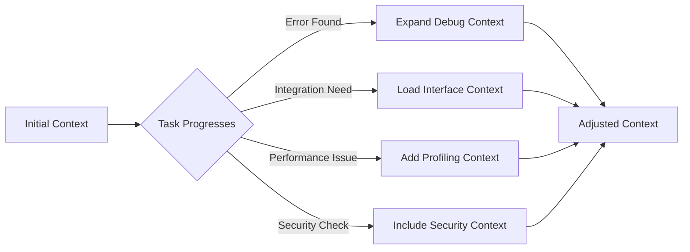

# PRISM Context Optimization Strategy
## Beyond Size Metrics: Task-Driven Dynamic Context

**Version**: 2.0  
**Date**: August 24, 2025  
**Paradigm Shift**: From "20KB target" to "Task-Optimal Context"

---

## 🎯 The Real Goal: Optimized != Minimized

### What "Optimized" Actually Means

Based on deep research into human expert behavior, optimized context has these characteristics:

1. **Complete for the Task** - All critical dependencies included
2. **Progressive Disclosure** - Start minimal, expand as needed
3. **Risk-Aware** - Never missing security/safety critical context
4. **Cognitively Manageable** - Not overwhelming the agent
5. **Dynamically Adjustable** - Can grow/shrink during task execution

### The Danger of Arbitrary Size Limits

**Too Little Context Risks:**
- **Silent Failures**: Missing edge cases or error handling
- **Security Vulnerabilities**: Not seeing attack vectors
- **Integration Breaks**: Missing dependency changes
- **Performance Regressions**: Unaware of scaling requirements
- **Incorrect Assumptions**: Working with outdated mental models

**Example**: The F-35 formation flying bug occurred because the software lacked context about plane positioning angles - a tiny piece of critical information.

---

## 🧠 How Human Experts Actually Gather Context

### 1. **The Sequential Layering Pattern**

Humans don't load everything at once. They follow this pattern:

```python
class HumanContextGathering:
    def gather_context(self, task):
        # Step 1: High-level understanding
        context = self.get_architecture_overview()
        
        # Step 2: Task-specific deep dive
        if self.need_more_detail(task):
            context += self.get_implementation_details()
        
        # Step 3: Progressive expansion
        while not self.sufficient_understanding():
            context += self.explore_dependencies()
            
        # Step 4: Risk mitigation
        context += self.check_critical_paths()
        
        return context
```

### 2. **The Relevance Filtering Model**

Experts use these signals to determine relevance:

```yaml
HIGH_RELEVANCE:
  - Immediate task impact
  - Security implications
  - Performance constraints
  - Direct dependencies
  - Recent changes
  
MEDIUM_RELEVANCE:
  - Historical patterns
  - Team conventions
  - Future considerations
  - Related features
  
LOW_RELEVANCE:
  - Tangential information
  - Outdated patterns
  - Over-specification
  - Noise factors
```

### 3. **The Dynamic Adjustment Pattern**

Context needs change during task execution:



---

## 📊 Task-Specific Context Profiles

### Debugging Profile
```yaml
CRITICAL_CONTEXT:
  - Error stack traces
  - Recent code changes
  - System state at failure
  - Similar historical issues
  
PROGRESSIVE_LAYERS:
  Layer_1: [error_location, immediate_dependencies]
  Layer_2: [call_chain, data_flow]
  Layer_3: [system_configuration, environment]
  
RISK_THRESHOLD: HIGH  # Can't afford to miss context
```

### Feature Development Profile
```yaml
CRITICAL_CONTEXT:
  - Requirements specification
  - API contracts
  - User stories
  - Architecture constraints
  
PROGRESSIVE_LAYERS:
  Layer_1: [immediate_interfaces, data_models]
  Layer_2: [related_features, dependencies]
  Layer_3: [performance_requirements, security_policies]
  
RISK_THRESHOLD: MEDIUM  # Balance completeness with speed
```

### Refactoring Profile
```yaml
CRITICAL_CONTEXT:
  - Current implementation
  - Test coverage
  - Dependency graph
  - Performance baselines
  
PROGRESSIVE_LAYERS:
  Layer_1: [code_to_refactor, immediate_tests]
  Layer_2: [dependent_code, integration_points]
  Layer_3: [historical_decisions, technical_debt]
  
RISK_THRESHOLD: HIGH  # Must not break existing functionality
```

### Security Review Profile
```yaml
CRITICAL_CONTEXT:
  - Attack surface
  - Authentication flows
  - Data handling
  - Third-party dependencies
  
PROGRESSIVE_LAYERS:
  Layer_1: [entry_points, auth_mechanisms]
  Layer_2: [data_flow, encryption_usage]
  Layer_3: [dependency_vulnerabilities, compliance_requirements]
  
RISK_THRESHOLD: MAXIMUM  # Cannot miss any security context
```

---

## 🔄 Dynamic Context Scoring Algorithm

Instead of targeting a size, we score context relevance:

```python
class ContextRelevanceScorer:
    def score_context(self, context_item, task, agent_state):
        score = 0.0
        
        # Task alignment (0-40 points)
        score += self.task_alignment_score(context_item, task)
        
        # Dependency distance (0-30 points)
        score += self.dependency_distance_score(context_item, task)
        
        # Risk mitigation (0-20 points)
        score += self.risk_mitigation_score(context_item)
        
        # Recency (0-10 points)
        score += self.recency_score(context_item)
        
        # Cognitive load adjustment (-20 to 0 points)
        score += self.cognitive_load_penalty(agent_state)
        
        return score
    
    def include_context(self, item):
        # Include if score > 50 OR is critical
        return item.score > 50 or item.is_critical
```

---

## 🎭 Context Personas: How Different Agents Think

### Frontend Developer Persona
```python
class FrontendContextStrategy:
    critical_always = ["component_tree", "props_flow", "state_management"]
    
    def relevance_check(self, manifest):
        # Frontend devs think in components and user flows
        if "database" in manifest or "deployment" in manifest:
            return 0.1  # Very low relevance
        if "component" in manifest or "ui" in manifest:
            return 0.9  # Very high relevance
        return 0.5  # Medium relevance
```

### Backend Architect Persona
```python
class BackendContextStrategy:
    critical_always = ["api_contracts", "database_schema", "auth_flow"]
    
    def relevance_check(self, manifest):
        # Backend architects think in data flows and systems
        if "component" in manifest or "css" in manifest:
            return 0.1  # Very low relevance
        if "api" in manifest or "database" in manifest:
            return 0.9  # Very high relevance
        return 0.5  # Medium relevance
```

### DevOps Engineer Persona
```python
class DevOpsContextStrategy:
    critical_always = ["deployment_config", "infrastructure", "monitoring"]
    
    def relevance_check(self, manifest):
        # DevOps thinks in pipelines and infrastructure
        if "style" in manifest or "component" in manifest:
            return 0.1  # Very low relevance
        if "deploy" in manifest or "config" in manifest:
            return 0.9  # Very high relevance
        return 0.5  # Medium relevance
```

---

## 📈 Measuring "Optimized" - New Metrics

### Instead of KB size, measure:

1. **Task Success Rate**: Did the agent complete the task correctly?
2. **Context Utilization**: What % of loaded context was actually used?
3. **Missing Context Events**: How often did agent need additional context?
4. **Cognitive Load Score**: Is the agent overwhelmed or confused?
5. **Risk Coverage**: Are all critical paths covered?

### The Optimization Formula

```python
optimization_score = (
    task_success_rate * 0.4 +
    context_utilization * 0.2 +
    (1 - missing_context_rate) * 0.2 +
    (1 - cognitive_overload) * 0.1 +
    risk_coverage * 0.1
)

# Optimized means score > 0.8, NOT size < 20KB
```

---

## 🚦 Risk-Based Context Requirements

### Critical Context (MUST HAVE)
These are loaded regardless of size:

```yaml
SECURITY_CRITICAL:
  - Authentication mechanisms
  - Data encryption points
  - Access control lists
  - Vulnerability patches

SAFETY_CRITICAL:
  - Error handling patterns
  - Rollback procedures
  - Data integrity checks
  - Failure recovery paths

COMPLIANCE_CRITICAL:
  - Regulatory requirements
  - Audit trails
  - Data privacy controls
  - Legal constraints
```

### Progressive Context (LOAD AS NEEDED)
These expand based on task progression:

```yaml
PERFORMANCE_CONTEXT:
  - Load when: Performance issues detected
  - Includes: Profiling data, bottlenecks, optimization history

INTEGRATION_CONTEXT:
  - Load when: Connecting to external systems
  - Includes: API specs, protocols, data formats

HISTORICAL_CONTEXT:
  - Load when: Debugging recurring issues
  - Includes: Past fixes, known issues, workarounds
```

---

## 🎯 Implementation Changes for PRISM

### 1. Replace Size Limits with Relevance Scoring
```python
# OLD: Dangerous size-based limit
if context_size > 20:  # KB
    compress_context()

# NEW: Smart relevance-based inclusion
if relevance_score > threshold or is_critical:
    include_context()
```

### 2. Implement Progressive Loading
```python
class ProgressiveContextLoader:
    def load_for_task(self, task, agent):
        # Start with critical context
        context = self.load_critical_context(task)
        
        # Let agent request more as needed
        while agent.needs_more_context():
            context += self.load_next_relevant_layer()
            
        return context
```

### 3. Add Risk Checks
```python
class RiskAwareContextValidator:
    def validate_context(self, context, task):
        # Never proceed without critical context
        if not self.has_security_context(context, task):
            raise ContextError("Missing critical security context")
            
        if not self.has_error_handling_context(context, task):
            raise ContextError("Missing error handling context")
            
        return True
```

---

## 📋 New Success Metrics for PRISM

### Primary Metrics (Quality over Quantity)
| Metric | Target | Measurement |
|--------|--------|-------------|
| Task Success Rate | >95% | Successful completions / Total tasks |
| Context Relevance | >80% | Used context / Loaded context |
| Critical Coverage | 100% | Critical contexts included / Required |
| Progressive Efficiency | >70% | Successful with initial context / Total |

### Secondary Metrics
| Metric | Target | Measurement |
|--------|--------|-------------|
| Context Size | Variable | Should vary by task complexity |
| Load Time | <2s | Initial context loading time |
| Expansion Events | <3/task | Additional context requests |
| Agent Confidence | >85% | Self-reported understanding level |

---

## 🚀 Revised PRISM Vision

**PRISM is not about making context smaller.**
**PRISM is about making context SMARTER.**

It should:
1. Know what's critical and never omit it
2. Start minimal but expand intelligently
3. Learn from task patterns, not size targets
4. Prioritize correctness over compression
5. Adapt dynamically during task execution

The goal is agents that work like human experts:
- Start with overview
- Dive deep where needed
- Expand when stuck
- Never miss critical context
- Stay focused on the task

**Success is measured by task outcomes, not KB counts.**

---

*"The best context is not the smallest context, but the right context at the right time."*